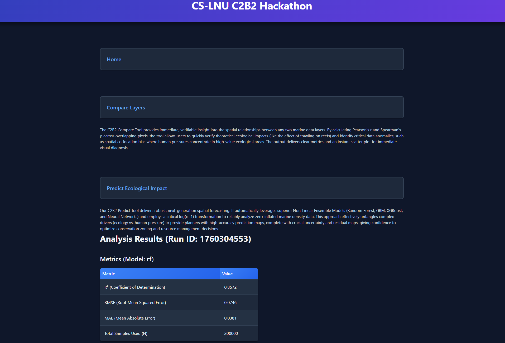
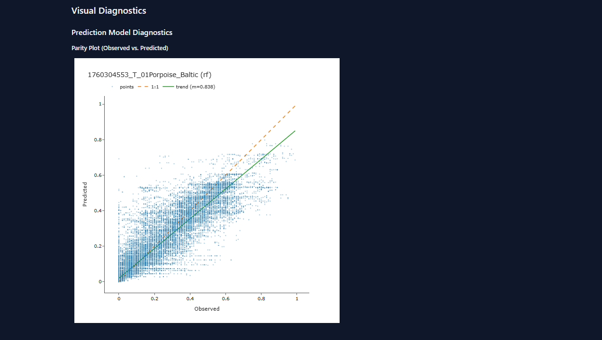
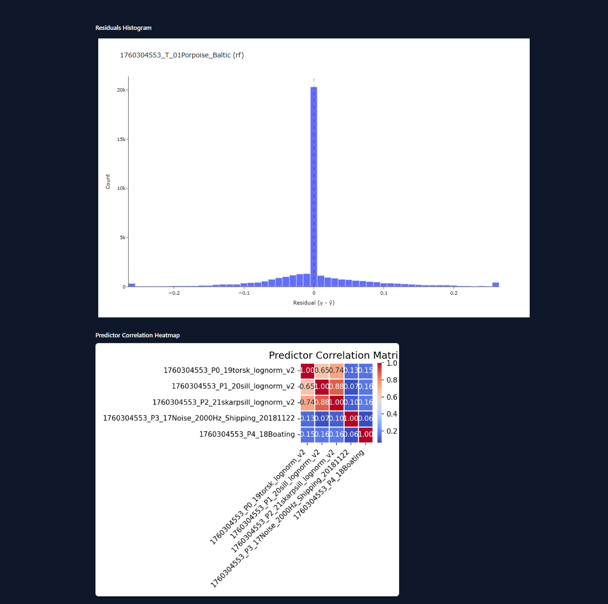

# C2B2 Symphony Raster Analytics

A Python toolkit and web application for marine spatial data analytics, built during the Mistra C2B2 Hackathon #1.

It enables correlation and predictive modeling across raster layers (GeoTIFFs) used in the Symphony ecosystem model by the Swedish Agency for Marine and Water Management.

## Features

- **Web Application**: A user-friendly web interface to run "Compare" and "Predict" analyses without using the command line.
- **symph-compare**: A command-line tool to compute pairwise Pearson/Spearman correlations between any two raster layers, generating an interactive scatter plot and a correlation heatmap.
- **symph-predict**: A command-line tool to predict a target raster from multiple predictor layers using a suite of high-performance models (Random Forest, GBM, XGBoost, Neural Networks).

## Screenshots

### Model Performance Metrics

*Comprehensive model evaluation metrics including R², RMSE, and MAE for multiple algorithms*

### Parity Plot Analysis

*Predicted vs. actual values visualization showing model accuracy across the full range of data*

### Correlation Heatmap & Distribution Analysis

*Feature correlation matrix and target variable distribution for understanding data relationships*

## Installation

### 1. Clone the repository

```bash
git clone https://github.com/SuyashMullick/layer-correlation-symphony
cd layer-correlation-symphony
```

### 2. Set up a virtual environment

```bash
python -m venv .venv
source .venv/bin/activate   # On macOS/Linux
# OR
.venv\Scripts\activate      # On Windows
```

### 3. Install dependencies

```bash
pip install -r requirements.txt
```

## Data Setup

The web application is pre-loaded with sample data. To use your own data, follow these steps.

### 1. Download datasets

Download the 2018 Symphony ecosystem and pressure layers from the Swedish Agency for Marine and Water Management:

- [Bottniska viken](https://www.havochvatten.se/)
- [Västerhavet](https://www.havochvatten.se/)
- [Östersjön](https://www.havochvatten.se/)

Unzip these files into `data/aligned/` (or any other folder). The web application will automatically find and list all `.tif` files located in the `data/aligned` directory.

💡 **Note**: The scripts assume all input rasters are aligned to the same grid (CRS, transform, and dimensions). You may need to pre-process your data using GIS software like QGIS or GDAL.

## Usage

### 🌐 Web Application UI

This is the simplest way to run analyses. The web application provides a graphical user interface for the compare and predict tools.

#### 1. Start the Web Server

From the root directory of the project, run:

```bash
python app.py
```

#### 2. Open the Application

Open your web browser and navigate to `http://127.0.0.1:5000`.

#### 3. Navigating the Application

**The Home Page**

The main page provides two choices: "Compare Layers" for simple two-layer correlation, and "Predict Ecological Impact" for more complex predictive modeling.

**The Compare Page**

This page is for a direct, one-to-one comparison between two raster layers. You can either select pre-loaded files from the dropdown menus or upload your own GeoTIFF files. Once you have selected two layers, click the "Compare Layers" button to start the analysis.

**The Predict Page**

This page allows you to predict a target variable using multiple predictor (or "driver") layers. Upload one target file and one or more predictor files. You can add more predictor file slots by clicking the "+ Add Another Predictor" button. Once your files are selected, click "Run Prediction" to train the models and generate results.

**Viewing Results**

After submitting a job from either the Compare or Predict page, a loading screen will appear. Once the analysis is complete, you will be redirected to the results page, which displays key metrics in a table and shows detailed, interactive diagnostic plots.

### 🔹 Command-Line Interface (Advanced)

For batch processing or more advanced control, you can use the command-line scripts directly.

#### 1. Compare Two Layers

Compare two raster layers pixel-wise to measure linear (Pearson) and rank (Spearman) correlations.

**Usage**

```bash
python -m cli.symph-compare 
  --a <path_to_layer_a.tif> 
  --b <path_to_layer_b.tif> 
  --out <output_folder> 
  [--nodata <nodata_values>]
```

**Example**

```bash
python -m cli.symph-compare
  --a data/aligned/naturvarden-.och-belastningar-ostersjon-2018/National_eco_E_2018/01Porpoise_Baltic.tif
  --b data/aligned/naturvarden-.och-belastningar-ostersjon-2018/National_press_E_2018/32Nitrogen_Background.tif
  --out out/compare/porpoise_vs_nitrogen
  --nodata "-9999"
```

**Outputs**

```
out/compare/porpoise_vs_nitrogen/
 ├─ metrics.csv                # Pearson r, Spearman rho, and pixel count
 ├─ metrics.json               # Metrics in JSON format
 ├─ scatter.html               # Interactive scatter plot
 └─ predictor_heatmap.png      # Correlation heatmap image
```

💡 For a full list of options, run `python -m cli.symph-compare -h`

#### 2. Predict Target from Multiple Layers

Train a model to predict one target raster from several predictor rasters.

**Usage**

```bash
python -m cli.symph-predict 
  --target <target.tif> 
  --predictors <x1.tif> <x2.tif> ... 
  --out <output_dir> 
  [--sample <n>] [--test_size <ratio>] 
  [--model {rf,gbm,xgb,nn,auto}] 
  [--remove_outliers] [--transform_y {none,log1p}]
```

**Example**

```bash
export BASE="data/aligned/naturvarden-och-belastningar-bottniska-viken-2018"  # On macOS/Linux
# OR
$BASE = "data/aligned/naturvarden-och-belastningar-bottniska-viken-2018"      # On Windows

python -m cli.symph-predict
  --target "$BASE/National_eco_N_2018/01Porpoise_Baltic.tif"
  --predictors
    "$BASE/National_eco_N_2018/20sill_lognorm_v2.tif"
    "$BASE/National_eco_N_2018/21skarpsill_lognorm_v2.tif"
    "$BASE/National_eco_N_2018/19torsk_lognorm_v2.tif"
    "$BASE/National_press_N_2018/17Noise_2000Hz_Shipping_20181122.tif"
    "$BASE/National_press_N_2018/18Boating.tif"
  --out "out/predict/N_porpoise_prey_noise_boating"
  --sample 200000
  --transform_y log1p
  --model rf
```

**Outputs**

```
out/predict/<name>/
├── feature_importance.csv
├── metrics.csv
├── parity.html
├── parity.png
├── predictor_heatmap.png
├── residuals.html
└── residuals.png
```

> 💡 For a full list of options, run `python -m cli.symph-predict -h`

---

## 📁 Repository Structure

```
layer-correlation-symphony/
├─ app.py                       # Main Flask web application
├─ cli/
│  ├─ symph-compare.py         # CLI for correlation analysis
│  └─ symph-predict.py         # CLI for predictive mapping
├─ src/                         # Core analytics and visualization modules
│  ├─ analysis/
│  ├─ geo/
│  └─ viz/
├─ static/                      # CSS and generated result files
├─ templates/                   # HTML templates for the web app
├─ data/
│  └─ aligned/                 # Location for input GeoTIFF layers
├─ out/                         # Default folder for CLI outputs
├─ screenshots/                 # Application screenshots
└─ requirements.txt             # Dependencies
```

## 👥 Credits

Developed for the **Mistra C2B2 Hackathon #1 (2025)** by:

- Younus Mashoor  - younusmashoor@gmail.com
- Suyash Mullick  - suyash.mullick@gmail.com
- Hamza Zia       - hamza.zia@lnu.se
- Abdullah Saeed  - as228aw@student.lnu.se


### Special Thanks To

- Amilcar Soares Junior
- Rafael Messias Martins

For their guidance and support throughout the project.

## 📜 License

MIT License — free to use, modify, and extend with attribution.